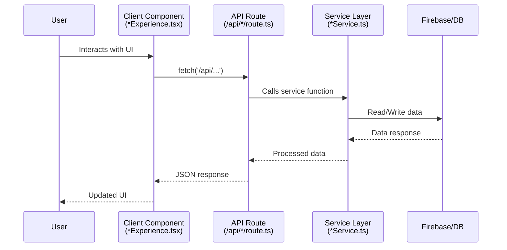

# Payout Codebase Architecture Walkthrough

A comprehensive breakdown of the client-side vs server-side execution in this Next.js application.

---

## Architecture Overview

```mermaid
flowchart LR
    subgraph Client["🌐 Client (Browser)"]
        Pages["Pages\n(dashboard, settings, etc.)"]
        Components["Components\n(*Experience.tsx, *Wizard.tsx)"]
        Hooks["Hooks\n(useToodlTheme, use-toast)"]
    end
    
    subgraph Server["🖥️ Server (Node.js)"]
        API["API Routes\n(/api/*)"]
        Services["Services\n(*Service.ts)"]
        Admin["Firebase Admin\n(firebaseAdmin.ts)"]
    end
    
    subgraph Shared["🔀 Shared/Isomorphic"]
        Utils["Utilities\n(dateUtils, currency, etc.)"]
    end
    
    Client -->|fetch()| API
    API -->|JSON| Client
    API --> Services
    Services --> Admin
    Client -.-> Utils
    Server -.-> Utils
```

---

## 🖥️ Server-Side Only (API Routes)

All files under `src/app/api/` run **exclusively on the server**. These handle secure operations, database access, and third-party integrations.

### API Endpoints

| Endpoint | Location | Purpose |
|----------|----------|---------|
| `/api/admin/*` | `src/app/api/admin/` | Admin operations |
| `/api/groups/*` | `src/app/api/groups/` | Group management (7 routes) |
| `/api/invite/*` | `src/app/api/invite/` | Invitation handling |
| `/api/mind/*` | `src/app/api/mind/` | AI/Mind features |
| `/api/orbit/*` | `src/app/api/orbit/` | Learning features (7 routes) |
| `/api/stripe/*` | `src/app/api/stripe/` | Payment/subscription handling |

### Key Server-Only Files

| File | Purpose |
|------|---------|
| `src/lib/firebaseAdmin.ts` | Firebase Admin SDK (server credentials) |
| `src/app/api/orbit/plan-lesson/route.ts` | Lesson planning API |
| `src/app/api/mind/ask/route.ts` | Mind AI query handler |

---

## 🌐 Client-Side (`"use client"` directive)

Components and pages with the `"use client"` directive at the top run in the browser. These handle user interactions, state management, and UI rendering.

### Client Pages (6 total)

| Page | File |
|------|------|
| Dashboard | `src/app/dashboard/page.tsx` |
| Settings | `src/app/settings/page.tsx` |
| Feedback | `src/app/feedback/page.tsx` |
| About | `src/app/about/page.tsx` |
| Split | `src/app/split/page.tsx` |
| Data Deletion | `src/app/data-deletion/page.tsx` |

### Client Components by Category

#### Layout Components
| Component | File |
|-----------|------|
| AppShell | `src/components/layout/AppShell.tsx` |
| AppSidebar | `src/components/layout/AppSidebar.tsx` |
| MobileNav | `src/components/layout/MobileNav.tsx` |
| AppTopBar | `src/components/AppTopBar.tsx` |

#### Feature Components (Experience/Wizard pattern)
| Component | File |
|-----------|------|
| FlowExperience | `src/components/flow/FlowExperience.tsx` |
| FlowWizard | `src/components/flow/FlowWizard.tsx` |
| BudgetExperience | `src/components/budget/BudgetExperience.tsx` |
| BudgetShareExperience | `src/components/budget/BudgetShareExperience.tsx` |
| ReflectionsExperience | `src/components/reflections/ReflectionsExperience.tsx` |
| ScratchPadExperience | `src/components/scratch/ScratchPadExperience.tsx` |

#### Orbit/Learning Components
| Component | File |
|-----------|------|
| LearningCarousel | `src/components/orbit/LearningCarousel.tsx` |
| LearningLessonCard | `src/components/orbit/LearningLessonCard.tsx` |
| InterestWizard | `src/components/orbit/InterestWizard.tsx` |
| LinkDetailPanel | `src/components/orbit/LinkDetailPanel.tsx` |
| TagInput | `src/components/orbit/TagInput.tsx` |

#### Mind Components
| Component | File |
|-----------|------|
| ToodlMindProvider | `src/components/mind/ToodlMindProvider.tsx` |
| ToodlMindLauncher | `src/components/mind/ToodlMindLauncher.tsx` |
| MindIdentityBridge | `src/components/mind/MindIdentityBridge.tsx` |

#### Marketing Components
| Component | File |
|-----------|------|
| LandingPage | `src/components/marketing/LandingPage.tsx` |
| LandingGate | `src/components/marketing/LandingGate.tsx` |

#### Settings Components
| Component | File |
|-----------|------|
| OrbitSettingsSection | `src/components/settings/OrbitSettingsSection.tsx` |
| SplitSettingsSection | `src/components/settings/SplitSettingsSection.tsx` |

#### UI Primitives (shadcn/ui)
| Component | File |
|-----------|------|
| Select | `src/components/ui/select.tsx` |
| Switch | `src/components/ui/switch.tsx` |
| Checkbox | `src/components/ui/checkbox.tsx` |
| Dropdown Menu | `src/components/ui/dropdown-menu.tsx` |
| Tooltip | `src/components/ui/tooltip.tsx` |
| Toast | `src/components/ui/toast.tsx` |
| Scroll Area | `src/components/ui/scroll-area.tsx` |
| Separator | `src/components/ui/separator.tsx` |
| Label | `src/components/ui/label.tsx` |

#### Other Client Components
| Component | File |
|-----------|------|
| FeedbackDialog | `src/components/FeedbackDialog.tsx` |
| FeedbackList | `src/components/FeedbackList.tsx` |
| ThemeToggle | `src/components/ThemeToggle.tsx` |
| PaymentSettingsDialog | `src/components/PaymentSettingsDialog.tsx` |
| OnboardingWizard | `src/components/onboarding/OnboardingWizard.tsx` |
| ReceiptUploadPanel | `src/components/ReceiptUploadPanel.tsx` |
| OrbitFlowNav | `src/components/OrbitFlowNav.tsx` |
| ReflectionsTile | `src/components/reflections/ReflectionsTile.tsx` |

### Client Hooks
| Hook | File |
|------|------|
| useToodlTheme | `src/hooks/useToodlTheme.ts` |
| use-toast | `src/hooks/use-toast.ts` |

---

## 🔀 Shared/Isomorphic (`src/lib/`)

These utility files can run on **either** client or server depending on where they're imported.

| File | Typical Usage | Notes |
|------|---------------|-------|
| `firebase.ts` | Client | Firebase client SDK |
| `firebaseAdmin.ts` | **Server only** | Firebase Admin SDK |
| `learningService.ts` | Server | Called from API routes |
| `journalService.ts` | Server | Called from API routes |
| `budgetService.ts` | Server | Called from API routes |
| `flowService.ts` | Both | Client state + server calls |
| `dateUtils.ts` | Both | Pure utility functions |
| `currency.ts` | Both | Currency formatting |
| `financeUtils.ts` | Both | Financial calculations |
| `firebaseUtils.ts` | Both | Firebase helpers |
| `theme.ts` | Client | Theme configuration |

---

## 📊 Data Flow Patterns

### Typical Feature Flow



### Example: Learning Feature Flow

1. **Client**: `LearningCarousel.tsx` displays learning tracks
2. **Client**: User clicks to generate a lesson
3. **API**: `POST /api/orbit/plan-lesson` is called
4. **Server**: `learningService.ts` generates lesson via AI
5. **Server**: Data saved to Firebase via Admin SDK
6. **Client**: UI updates with new lesson content

---

## Key Architectural Patterns

### 1. Experience/Wizard Pattern
Main features follow a consistent pattern:
- `*Experience.tsx` - Main container component (client)
- `*Wizard.tsx` - Multi-step creation flow (client)
- `*Service.ts` - Business logic (server)

### 2. API Route Convention
All API routes use the Next.js App Router format:
```
src/app/api/[feature]/[action]/route.ts
```

### 3. Firebase Split
- **Client SDK** (`firebase.ts`): Authentication, real-time listeners
- **Admin SDK** (`firebaseAdmin.ts`): Secure server-side operations

---

## Type Definitions

Shared types are defined in `src/types/`:

| File | Purpose |
|------|---------|
| `orbit.ts` | Learning/Orbit feature types |
| Other type files | Feature-specific type definitions |

---

*Generated on: December 9, 2025*
